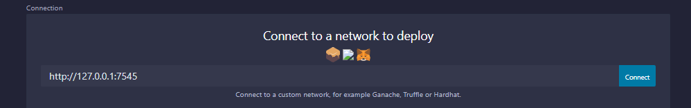
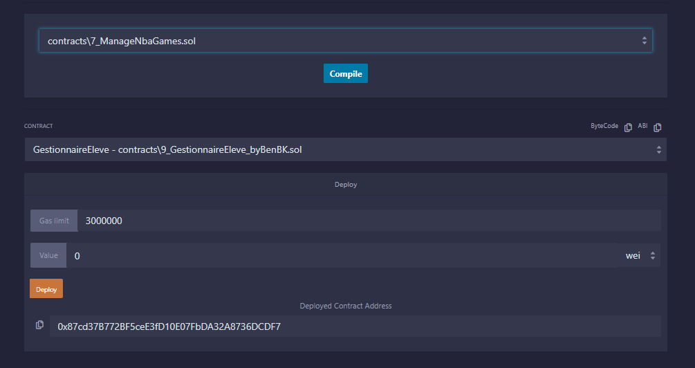
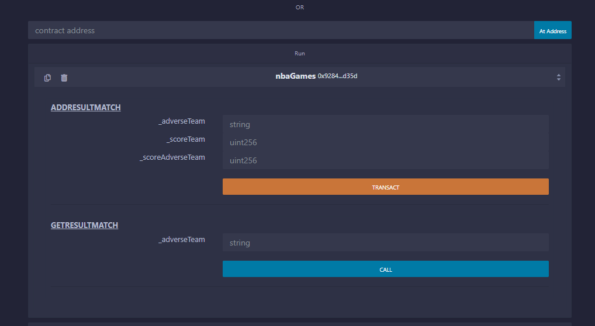

# solidity-exercises
## Description des exercices
Regroupe l'ensemble des exercices réalisés pour apprendre solidity :  
  
1 - Tester un getter/setter sur différents types de variable pour savoir comment compiler, déployer le contrat sur une blockchain (via [Ganache](https://trufflesuite.com/ganache/)) et jouer avec.  
2 - Tester les transactions d'ether, cumuler les sommes envoyées et récupérer la dernière adresse qui a payé.  
3 - Tester le type 'mapping' et le bloc if/else pour cumuler les sommes d'argent envoyées par une même adresse.  
4 - Tester le type 'struct' pour cumuler les sommes d'argent envoyées et le nombre de paiements réalisés par l'adresse qui interroge le smart contract.  
5 - Créer un wallet pour envoyer de l'argent à quelqu'un en partie ou entièrement, ou, récupérer tout son propre argent.  
6 - Tester les tableaux de type storage et memory.  
7 - Gestion des résultats des matchs de basket d'une équipe (ENUM, Mapping+Array+Struct, date, boucle for).  
8 - Jeu pour retrouver le nombre que le propriétaire du contrat a placé (constructor / selfdestruct, require / revert / assert).  
9 - Projet Solidity présenté par [Ben BK](https://www.youtube.com/@BenBK) : [Gestionnaire d'élève](https://www.youtube.com/watch?v=fLi70h1Vje8&list=PLBV4f2pTYexqgdiVpLOWlF-E5sTLPimot&index=15) revu avec une gestion des matières pré-définies en tableau (struct in struct / array / mapping / bytes / require / for)  
10 - Test des modifiers, de l'héritage et de l'import avec un constructor et destroy.  
11 - Exercice du wallet avec un évènement (event / emit).  
12 - Visibilité des fonctions et variables (view / pure / public / private / internal / external).  
13 - Les types de variables (storage / memory / calldata).  
14 - Les évènements pour renvoyer des données à un front-end (event / emit).  
15 - Utiliser des librairies (exemple réalisé avec [OpenZeppelin](https://github.com/OpenZeppelin/openzeppelin-contracts))  
16 - Faire communiquer 2 smart contracts en utilisant une interface.  
17 - Création d'une "factory" pour créer des smart contracts.  
18 - Mixte des exercices 5 et 10 pour créer un Wallet avec la notion de propriétaire de contrat.  

2 exercices ont été réalisés dans le répertoire Alyra lors de ma formation :  
- Le jeu "Deviné c'est gagné" ;  
- Un système de notations ;  
## Environnement de travail
### Outils
 - [VS Code](https://code.visualstudio.com/)
 - [Plugin Ethereum Remix](https://github.com/ethereum/remix-vscode)
 - [Ganache](https://trufflesuite.com/ganache/)

### Déploiement d'un smart contract
1. Développement sur [VS Code](https://code.visualstudio.com/).  
2. Sur le [plugin Ethereum Remix](https://github.com/ethereum/remix-vscode), je choisis mon compiler (Set compiler version), je clique sur "Run & Deploy" et choisis "Activate".  
3. Je lance [Ganache](https://trufflesuite.com/ganache/) et utilise le "Quickstart".  
4. Sur le [plugin Ethereum Remix](https://github.com/ethereum/remix-vscode), je me connecte au noeud privé généré par Ganache en cliquant sur "Connect".
5. Je choisis mon smart contract, je compile et je le déploie.  
  
  
6. Il ne me reste plus qu'à jouer avec !  
  

## Inspirations
 - [Ben BK](https://www.youtube.com/@BenBK)
 - [Documentation officielle](https://docs.soliditylang.org/)
 - [Crypto Zombies](https://cryptozombies.io/fr/)
 - [Maîtriser Ethereum](https://github.com/maitriser-ca/LivreMaitriserEthereum)
